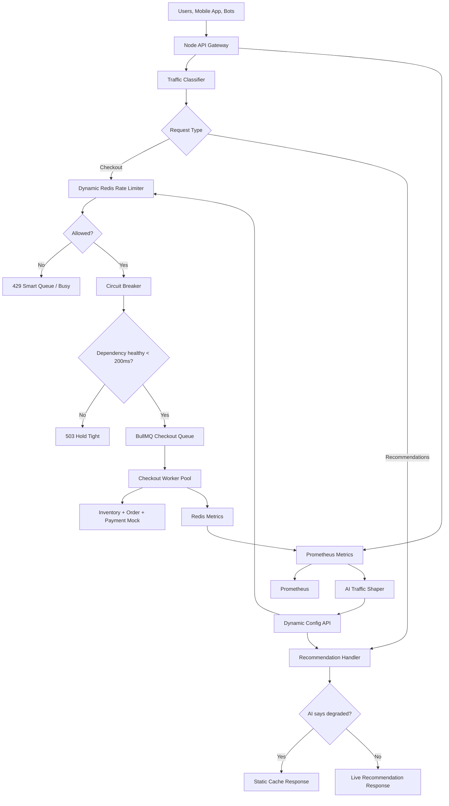
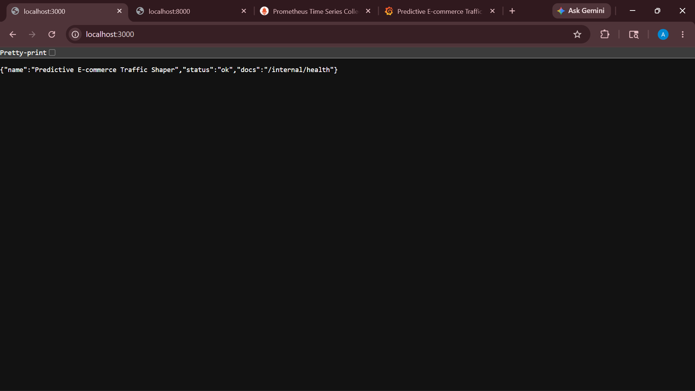
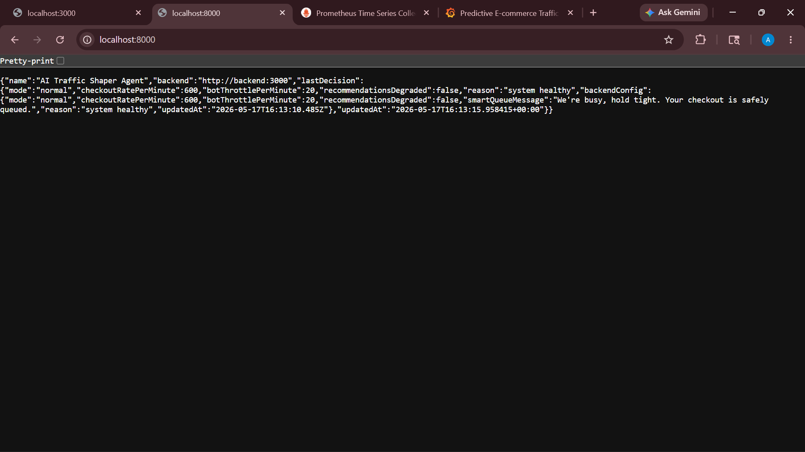
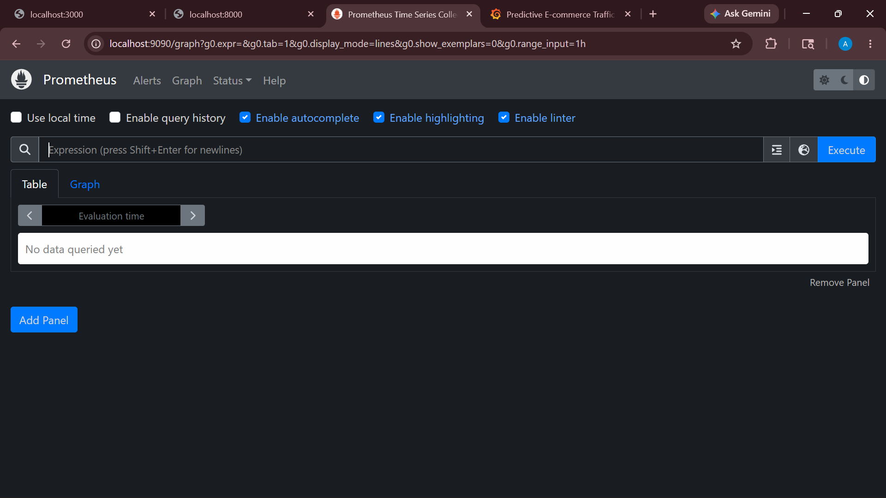
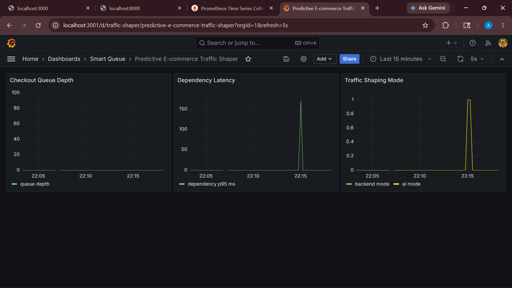

# Predictive E-commerce Traffic Shaper

AI-driven Smart Queue for flash-sale checkout traffic. The system protects checkout during 100x traffic spikes by combining queue-based order intake, circuit breakers, dynamic rate limiting, degraded low-priority traffic, observability, and an AI traffic-shaping agent.

## What This Demonstrates

- **High-scale resilience:** checkout requests are accepted into a Redis-backed BullMQ queue and processed by horizontally scalable workers.
- **Circuit breaking:** if downstream latency crosses `200ms`, checkout admission fails fast with a busy response instead of collapsing the service.
- **AI-native traffic shaping:** a Python FastAPI agent watches live health metrics and changes rate limits, queue mode, bot throttling, and recommendation fallback behavior.
- **Economic discipline:** payments and checkout stay prioritized while low-value traffic can be redirected to cache.
- **Observability:** Prometheus scrapes service metrics and Grafana visualizes pressure, latency, errors, and AI decisions.

## Architecture



## Project Layout

```text
.
├── backend/
│   ├── src/
│   │   ├── server.js
│   │   ├── worker.js
│   │   ├── routes/
│   │   └── services/
│   ├── tests/
│   ├── Dockerfile
│   └── package.json
├── ai-agent/
│   ├── main.py
│   ├── traffic_analyzer.py
│   ├── requirements.txt
│   └── Dockerfile
├── load-tester/
│   ├── k6-flash-sale.js
│   └── k6-bot-attack.js
├── monitoring/
│   ├── prometheus.yml
│   └── grafana/
├── docker-compose.yml
└── docs/
```

## Quick Start

```bash
docker compose up --build
```

Services:

- Backend API: `http://localhost:3000`
- AI agent: `http://localhost:8000`
- Prometheus: `http://localhost:9090`
- Grafana: `http://localhost:3001` with `admin/admin`

## Useful API Calls

Create a checkout request:

```bash
curl -X POST http://localhost:3000/checkout \
  -H "Content-Type: application/json" \
  -d '{"userId":"u-1","cartId":"cart-1","items":[{"sku":"lipstick-01","qty":1}],"priority":"normal"}'
```

Check dynamic config:

```bash
curl http://localhost:3000/internal/config
```

Force stress mode manually:

```bash
curl -X PUT http://localhost:3000/internal/config \
  -H "Content-Type: application/json" \
  -d '{"mode":"critical","checkoutRatePerMinute":60,"recommendationsDegraded":true,"botThrottlePerMinute":5,"reason":"manual demo"}'
```

## Load Testing

Install k6 locally, then run:

```bash
k6 run load-tester/k6-flash-sale.js
k6 run load-tester/k6-bot-attack.js
```

For a heavier spike:

```bash
k6 run -e BASE_URL=http://localhost:3000 -e VUS=10000 load-tester/k6-flash-sale.js
```

## AI Agent Behavior

The agent reads backend health every five seconds:

- p95 latency
- checkout queue depth
- request rate
- error rate
- circuit state
- suspicious traffic ratio

It then writes a new shaping policy back to the backend:

| Condition | Action |
| --- | --- |
| Healthy | normal limits, live recommendations |
| Surge | reduce checkout intake slightly |
| Critical latency / queue pressure | open smart queue, degrade recommendations |
| Bot attack | aggressively throttle suspicious user agents |

## AI-Native Development Note

The tests and API documentation were intentionally structured for AI-assisted expansion. In a real submission, mention that roughly **70% of the test suite boilerplate was AI-generated and human-reviewed** to maintain delivery velocity while preserving engineering judgment.

## Suggested Demo Script

1. Start Docker Compose.
2. Open Grafana and Prometheus.
3. Run `k6-flash-sale.js`.
4. Watch queue depth and p95 latency rise.
5. Show the AI agent switching mode from `normal` to `surge` or `critical`.
6. Run `k6-bot-attack.js`.
7. Show bot throttling while checkout stays available.

## 📊 Screenshots

### Backend API Health Status


### AI Traffic Shaper Agent Status


### Prometheus Monitoring Dashboard


### Grafana Real-time Traffic Visualization


