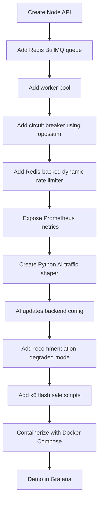
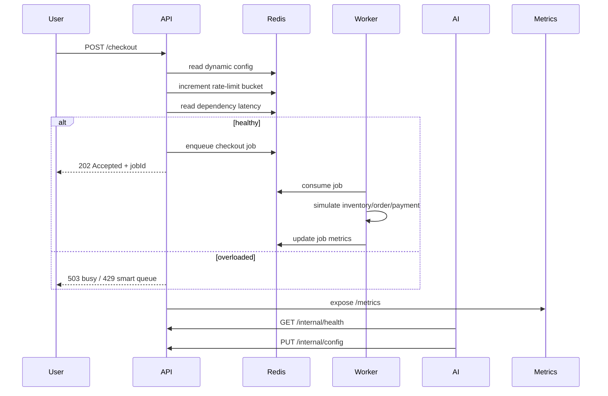

# Build Flow

```mermaid
flowchart TD
    A["Create Node API"] --> B["Add Redis BullMQ queue"]
    B --> C["Add worker pool"]
    C --> D["Add circuit breaker using opossum"]
    D --> E["Add Redis-backed dynamic rate limiter"]
    E --> F["Expose Prometheus metrics"]
    F --> G["Create Python AI traffic shaper"]
    G --> H["AI updates backend config"]
    H --> I["Add recommendation degraded mode"]
    I --> J["Add k6 flash sale scripts"]
    J --> K["Containerize with Docker Compose"]
    K --> L["Demo in Grafana"]
```

## Runtime Request Flow

```mermaid
sequenceDiagram
    participant User
    participant API
    participant Redis
    participant Worker
    participant AI
    participant Metrics

    User->>API: POST /checkout
    API->>Redis: read dynamic config
    API->>Redis: increment rate-limit bucket
    API->>Redis: read dependency latency
    alt healthy
        API->>Redis: enqueue checkout job
        API-->>User: 202 Accepted + jobId
        Worker->>Redis: consume job
        Worker->>Worker: simulate inventory/order/payment
        Worker->>Redis: update job metrics
    else overloaded
        API-->>User: 503 busy / 429 smart queue
    end
    API->>Metrics: expose /metrics
    AI->>API: GET /internal/health
    AI->>API: PUT /internal/config
```

